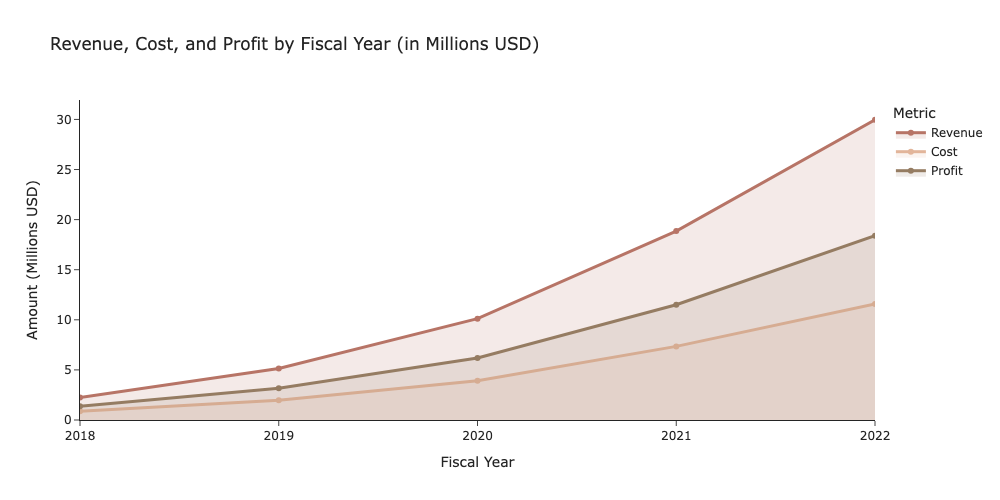

# AtliQ Hardware - Financial Analysis

This project analyzes **AtliQ Hardware’s** financial performance from **FY2018–FY2022**.  
The goal was to assess profitability trends, unit economics, category performance, and regional contribution, and to summarize insights in an interactive Tableau dashboard.

🔗 **Dashboard:** [AtliQ Hardware — Financial Dashboard](https://public.tableau.com/views/AtliQ_Hardware_Financial_Analysis/DashboardFinancialOverview?:language=en-US&:sid=&:redirect=auth&:display_count=n&:origin=viz_share_link)

🔧 **Tools:** SQL, Python (Pandas), Tableau

---

## 📌 Project Overview
The analysis combines sales, pricing, manufacturing cost, discount, product, and customer data into a unified dataset.  
Key research questions:

1. How revenue, cost, and profit change over time  
2. Which product categories drive profitability  
3. How unit economics evolve  
4. Which regions and markets contribute the most to profit  
5. Whether the business is scaling efficiently (margin, ROI trends)

---

## 🧩 Data Preparation
- Connected multiple SQL tables (sales, cost, price, discount, product, customer)  
- Built a consolidated dataset using SQL JOINs  
- Cleaned missing values and corrected data types  
- Added fiscal and calendar time features (month/year)  

---

## 📊 Key Calculations
The following metrics were computed for analysis:
- **Revenue** (with discount applied)  
- **Cost** (manufacturing)  
- **Profit**  
- **Unit profit**  
- **Profit margin (%)**  
- **ROI (%)**  

---

## 📈 Main Visualizations
(All created with Python & Tableau)

- Revenue, Cost & Profit by Fiscal Year  
- Monthly Profit Trends  
- Profit by Product Category  
- Unit Economics (Unit Profit, Price, Cost)  
- Profit Margin Trend  
- ROI Trend  
- Profit by Region & Market  

---

## 💡 Insights & Findings (Short Summary)
- Revenue, cost, and profit show **steady multi-year growth**  
- Profit grows faster than cost -> **scaling efficiency**  
- Profit is heavily concentrated in **two product categories**  
- **APAC (mainly India)** generates 60%+ of all profit  
- Unit profit increases year over year due to **pricing strength**  
- Profit margin and ROI remain high but **stable**  

---

## 📍 Strategic Recommendations
- Diversify beyond top product categories to reduce concentration risk  
- Strengthen presence in EU & NA; explore LATAM  
- Monitor pricing power to ensure sustainability  
- Improve cost efficiency through supply chain optimization  
- Use dashboard for ongoing performance monitoring  

---

## 📁 Project Structure
01_final_project_atliq_hardware/  
│── README.md  
│── atliq_hardware_financial_analysis.ipynb  
│── base_fin_clean.csv   
│── financial_performance.png

---

## 📝 Notes
This project was completed as part of the **TripleTen Data Analytics Bootcamp** and serves as a capstone demonstrating SQL, Python, and visualization skills.
