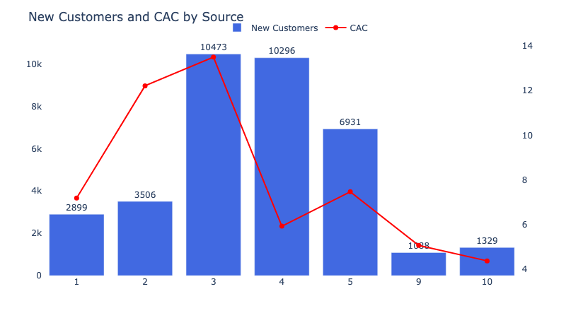

# Yandex.Afisha - Business & Marketing Analytics

This project analyzes user behavior and marketing efficiency for **Yandex.Afisha** over the period **June 2017 – May 2018**.  
The goal is to help the marketing team **optimize ad spend** by understanding how users use the product, when they convert, how much revenue they bring, and how quickly marketing investments pay off.

## 🔍 Project Tasks

- Analyze **product usage**:
  - DAU / WAU / MAU
  - Number of sessions per day
  - Session duration & retention by cohort and device
- Analyze **sales performance**:
  - Conversion delay (from registration to first purchase)
  - Orders per user, repeat purchases
  - Average Order Value (AOV)
  - Customer Lifetime Value (LTV)
- Analyze **marketing efficiency**:
  - Total spend and spend dynamics by source
  - **CAC** per source and device
  - **ROI** and payback period by cohorts and sources

## 📊 Key Findings

- **Retention is very low**: 90–95% of users churn after the first week; only ~1–2% stay active long term.
- Most users **either buy on day 0 or never buy at all**: ~84% never convert, ~12% convert on the registration day.
- The majority of customers make **only one order**; repeat purchases are rare.
- Average customer LTV is **≈5–8 USD**, with the best cohort reaching **≈13 USD** in 3–4 months.
- **Source 4** is the most efficient channel: low CAC (~5.9) and >10k acquired users.
- **Sources 9 and 10** are also highly efficient (low CAC), but currently small in scale.
- **Source 3** is the least efficient: the highest CAC (~13.5) and the largest share of total spend.
- Desktop users have **higher LTV and ROI** than touch users, despite similar CAC.

## ✅ Recommendations

- **Scale Source 4** — best combination of scale and cost-efficiency.
- **Maintain and test scaling** of Sources 9 and 10 (very low CAC, good ROI).
- **Reduce or optimize spending on Source 3** — expensive and inefficient.
- Keep Sources 1, 2, and 5 but **optimize targeting/creatives** to improve CAC and ROI.
- Focus retention and engagement efforts on the **first 3–4 months** of user life, where most value is generated.
- Reconsider budget allocation for later months (after Dec 2017), as later cohorts show weaker ROI and slower payback.

## 🛠 Tools & Methods

Python, pandas, numpy, matplotlib, seaborn, plotly  
Cohort analysis, retention curves, conversion delay buckets, AOV, LTV, CAC, ROI, payback period.

## 📁 Project Structure

03_yandex_afisha_business_analytics/  
│── README.md  
│── yandex_afisha_business_analytics.ipynb  
│── customers_cac_by_source.png

> *This project was completed during the TripleTen Data Analysis Bootcamp.*
